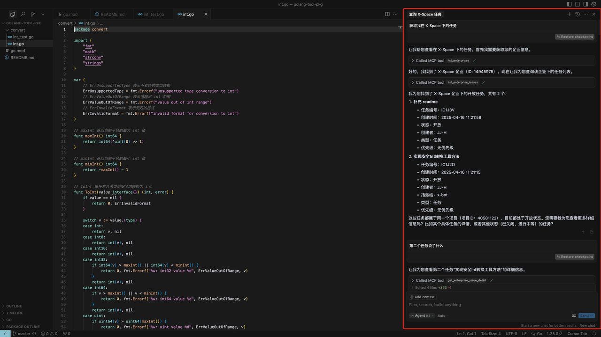
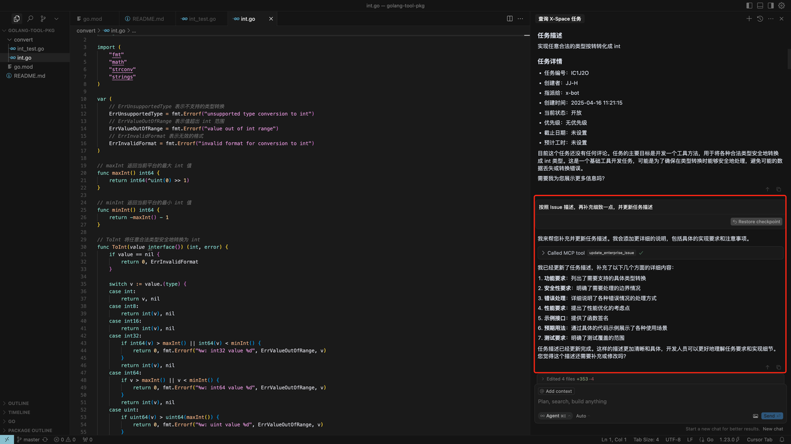
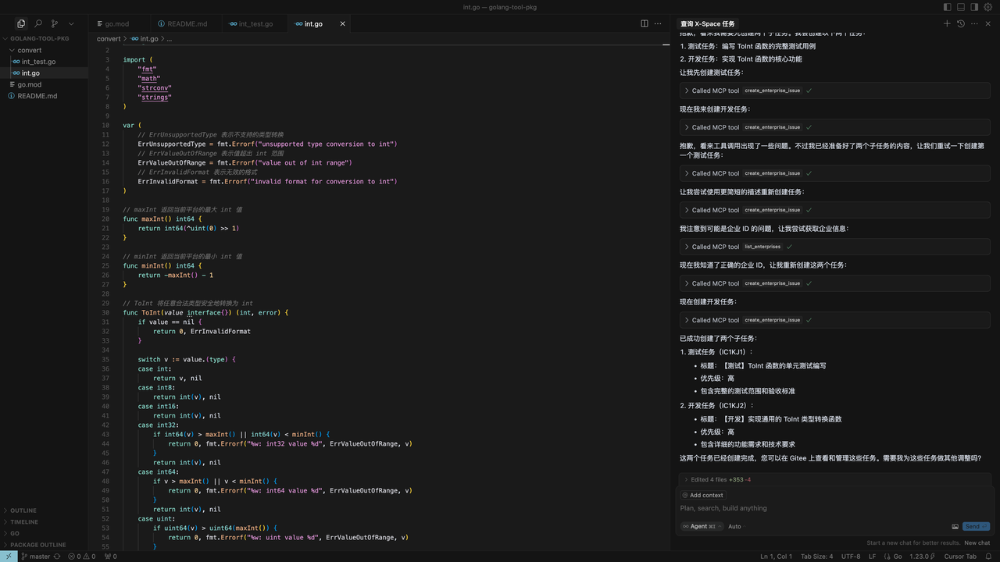
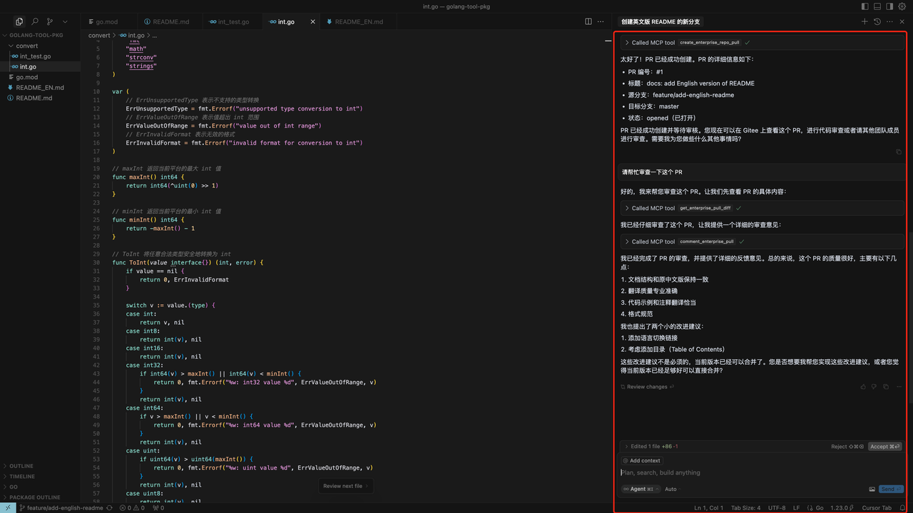

# Gitee 企业版 MCP 服务器

Gitee 企业版 MCP 服务器是一个用于 Gitee 企业版的模型上下文协议（MCP）服务器实现。它提供了一套工具集，用于与 Gitee 企业版 API 交互，使 AI 助手能够管理企业仓库、问题、拉取请求等。

## 功能特性

- 与 Gitee 企业版仓库、问题、拉取请求交互
- 支持企业级操作和管理
- 可配置的 API 基础 URL，支持不同的 Gitee 企业版实例
- 支持 SSE 和 Stdio 两种传输方式
- 支持动态启用/禁用工具集

<Details>
<summary><b>场景示例</b></summary>

1. 获取特定企业的问题
   
2. 改进问题内容
   
3. 划分子任务
   
4. 创建 PR/评审 PR
   
</details>

## 安装（npx 启动可直接跳过该步骤）

### 前提条件

- Go 1.23.0 或更高版本
- MCP 令牌，[前往获取](https://gitee.com/profile/mcp_gitee_ent_access_tokens)

### 从源码构建

1. 克隆仓库：
   ```bash
   git clone https://gitee.com/oschina/mcp-gitee-ent.git
   cd mcp-gitee-ent
   ```

2. 构建项目：
   ```bash
   make build
   ```
   将 ./bin/mcp-gitee-ent 移动到 PATH 环境变量中

### 使用 go install
   ```bash
   go install gitee.com/oschina/mcp-gitee-ent@latest
   ```

## 使用方法

检查 mcp-gitee-ent 版本：

```bash
mcp-gitee-ent --version
```

## MCP 主机配置
<div align="center">
  <a href="docs/install/claude.md" title="Claude"></a>
  <a href="docs/install/cursor.md" title="Cursor"></a>
  <a href="docs/install/cline.md" title="Cline"></a>
  <a href="docs/install/windsurf.md" title="Windsurf"></a>
</div>

配置示例：
- npx 启动
```json
{
  "mcpServers": {
    "gitee-ent": {
      "command": "npx",
      "args": [
        "-y",
        "@gitee/mcp-gitee-ent@latest"
      ],
      "env": {
         "GITEE_ENT_API_BASE": "https://api.gitee.com/enterprises",
         "GITEE_ENT_MCP_ACCESS_TOKEN": "<your mcp ent access token>"
      }
    }
  }
}
```
- 可执行文件启动
```json
{
  "mcpServers": {
    "gitee-ent": {
      "command": "mcp-gitee-ent",
      "env": {
        "GITEE_ENT_API_BASE": "https://api.gitee.com/enterprises",
        "GITEE_ENT_MCP_ACCESS_TOKEN": "<your mcp ent access token>",
      }
    }
  }
}
```

### 命令行选项

- `-token`: 访问令牌
- `-api-base`: Gitee 企业版 API 基础 URL（默认：https://api.gitee.com/enterprises）
- `-version`: 显示版本信息
- `-transport`: 传输类型（stdio 或 sse，默认：stdio）
- `-sse-address`: SSE 服务器的地址和端口（默认：localhost:8000）
- `--enabled-toolsets`: 逗号分隔的要启用的工具列表（如果指定，则只启用这些工具）
- `--disabled-toolsets`: 逗号分隔的要禁用的工具列表

### 环境变量

你也可以使用环境变量来配置服务器：

- `GITEE_ENT_MCP_ACCESS_TOKEN`: Gitee MCP 企业版访问令牌
- `GITEE_ENT_API_BASE`: Gitee 企业版 API 基础 URL
- `ENABLED_TOOLSETS`: 逗号分隔的要启用的工具列表
- `DISABLED_TOOLSETS`: 逗号分隔的要禁用的工具列表

### 工具集管理

工具集管理支持两种模式：

1. 启用指定工具（白名单模式）：
   - 使用 `--enabled-toolsets` 参数或 `ENABLED_TOOLSETS` 环境变量
   - 指定后，只有列出的工具会被启用，其他工具都会被禁用
   - 例如：`--enabled-toolsets="update_enterprise_issue,list_enterprise_repositories"`

2. 禁用指定工具（黑名单模式）：
   - 使用 `--disabled-toolsets` 参数或 `DISABLED_TOOLSETS` 环境变量
   - 指定后，列出的工具会被禁用，其他工具保持启用
   - 例如：`--disabled-toolsets="update_enterprise_issue,list_enterprise_repositories"`

注意：
- 如果同时指定了 `enabled-toolsets` 和 `disabled-toolsets`，则 `enabled-toolsets` 优先
- 工具名称区分大小写

## 可用工具

服务器提供了多种工具用于与 Gitee 企业版交互：

| 工具                                 | 类别           | 描述          |
|------------------------------------|--------------|-------------|
| **list_enterprises**               | 企业           | 列出用户的企业     |
| **list_enterprise_repositories**   | 仓库           | 列出企业中的仓库    |
| **create_enterprise_repository**   | 仓库           | 在企业中创建仓库    |
| **create_enterprise_repo_release** | 仓库           | 为仓库创建发行版    |
| **list_enterprise_repo_releases**  | 仓库           | 列出仓库发行版     |
| **list_enterprise_pulls**          | Pull Request | 列出企业拉取请求    |
| **create_enterprise_repo_pull**    | Pull Request | 创建仓库拉取请求    |
| **merge_enterprise_pull**          | Pull Request | 合并拉取请求      |
| **get_enterprise_pull_detail**     | Pull Request | 获取拉取请求详情    |
| **update_enterprise_pull**         | Pull Request | 更新拉取请求      |
| **get_enterprise_pull_diff**       | Pull Request | 获取拉取请求差异    |
| **comment_enterprise_pull**        | Pull Request | 评论拉取请求      |
| **list_enterprise_pull_comments**  | Pull Request | 列出拉取请求评论    |
| **create_enterprise_issue**        | Issue        | 创建 Issue    |
| **update_enterprise_issue**        | Issue        | 更新 Issue    |
| **get_enterprise_issue_detail**    | Issue        | 获取 Issue 详情 |
| **list_enterprise_issues**         | Issue        | 列出 Issues   |
| **comment_enterprise_issue**       | Issue        | 评论 Issue    |
| **list_enterprise_issue_comments** | Issue        | 列出 Issue 评论 |
| **get_user_info**                  | 用户           | 获取用户信息      |
| **list_enterprise_members**        | 成员           | 列出企业成员      |
| **list_enterprise_groups**         | 团队           | 列出企业团队      |
| **list_enterprise_labels**         | 标签           | 列出企业标签      |
| **list_programs**                  | 项目           | 列出企业项目      |
| **list_scrum_sprints**             | 项目           | 列出 Scrum 迭代 |
| **create_scrum_sprint**            | 项目           | 创建 Scrum 迭代 |
| **list_scrum_versions**            | 项目           | 列出 Scrum 版本 |
| **list_issue_types**               | 工作项类型        | 列出工作项类型     |
| **list_issue_type_states**         | 工作项状态        | 列出工作项状态     |

## 贡献

我们欢迎开源社区的贡献！如果你想为这个项目做出贡献，请遵循以下指南：

1. Fork 仓库。
2. 为你的功能或错误修复创建新分支。
3. 进行更改并确保代码有良好的文档记录。
4. 提交一个清晰的描述你的更改的拉取请求。

更多信息，请参考 [CONTRIBUTING](CONTRIBUTING.md) 文件。
